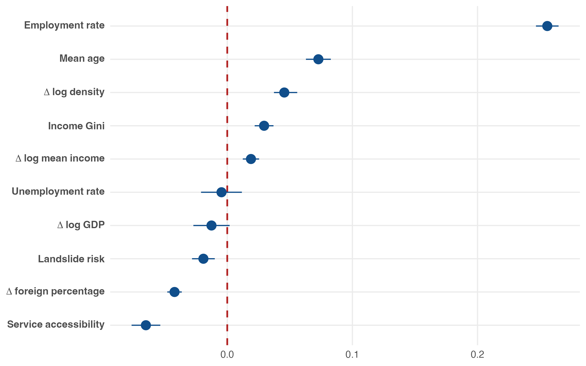
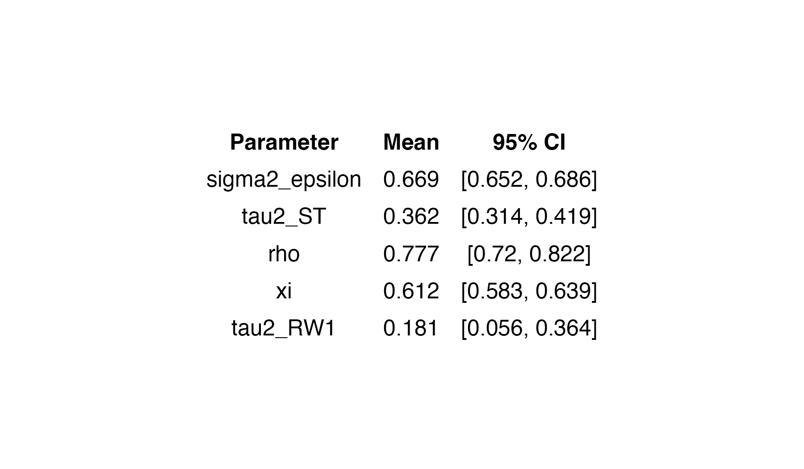
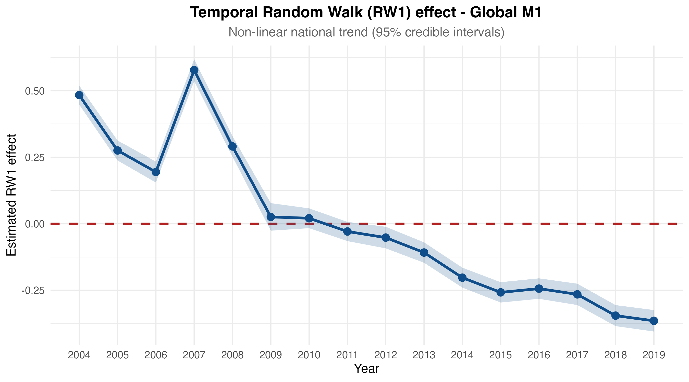
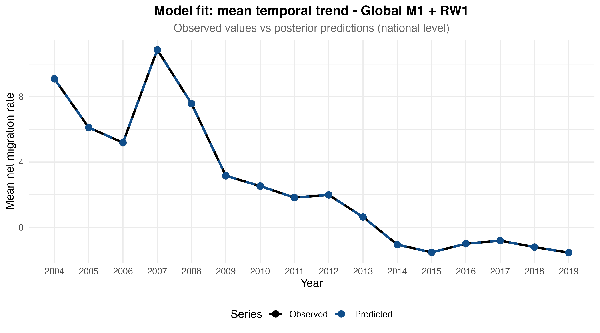
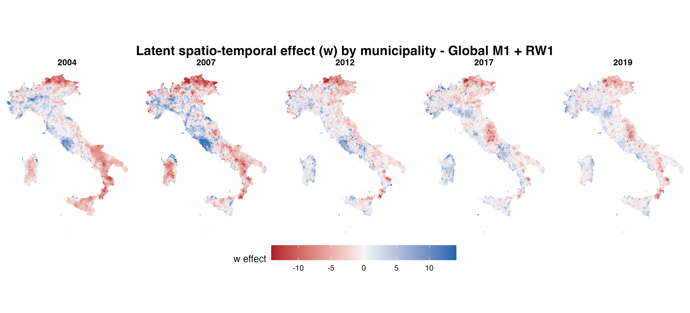
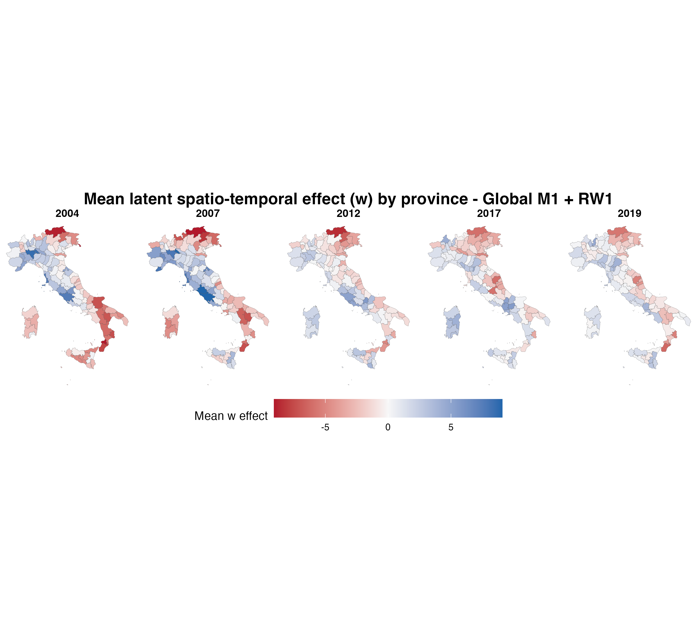
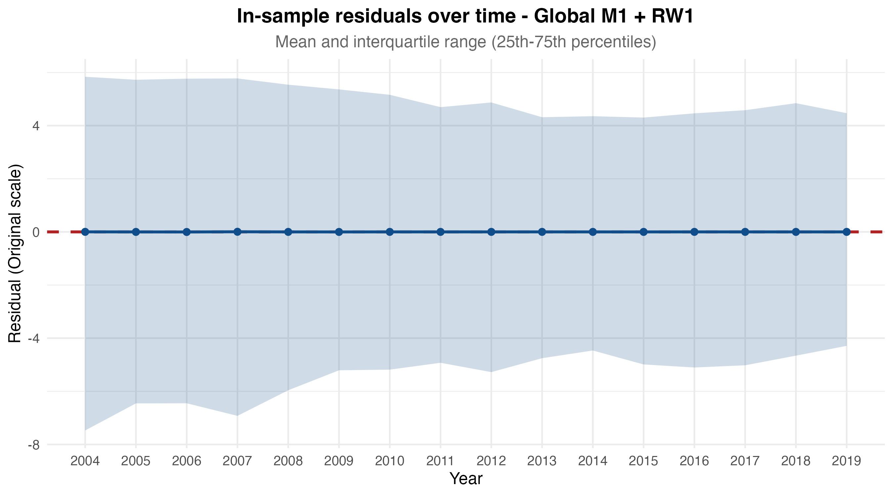
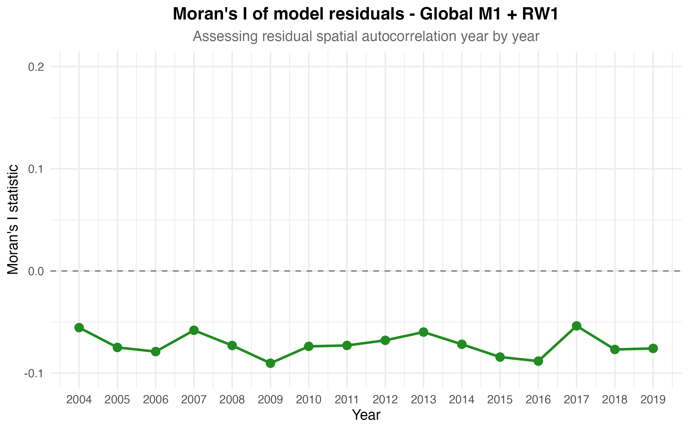

# M1 — Global Model: National Effects, Temporal Trends, and Diagnostics

This folder contains the main figures from the **M1 global model**, estimated over the full 2004–2019 period.

M1 fits a single national specification for all socio-economic and demographic covariates, along with a non-linear temporal Random Walk (RW1) trend and a spatio-temporal latent field to capture unobserved heterogeneity.

The figures describe the average national covariate associations, structural temporal dynamics, and model diagnostic performance.

---

## 1. National fixed effects and hyperparameters

These figures report the posterior means and 95% credible intervals for the global fixed effects and model hyperparameters.

- **Fixed effects (`24_forest_plot_fissi.png`)**: Shows the estimated impact of each covariate on the original scale. Economic vitality, represented by the **Employment rate**, is the primary positive driver of net migration. Conversely, **Service accessibility** (higher values mean greater inaccessibility), **$\Delta$ foreign percentage**, and **Landslide risk** act as the strongest repelling factors.
- **Hyperparameters (`25_iperparametri_tabella.png`)**: Summarizes the variance and dependence parameters. Notably, the temporal autoregressive parameter (`rho` = 0.777) indicates strong persistence in the latent field, while the variance components (`tau2_ST`, `tau2_RW1`) quantify the residual unobserved heterogeneity.

---

## 2. Temporal dynamics and model fit

These figures illustrate the temporal behavior of the model and its ability to replicate observed national trends:

- **Temporal RW1 effect (`20_temporal_rw1_effect.png`)**: Isolates the non-linear temporal trend (RW1). It reveals a severe structural break coinciding with the 2008 global financial crisis, displaying a vertical collapse followed by a continuous decline up to 2019.
- **Model fit (`26_trend_temporale_fit.png`)**: Compares the observed mean net migration rate with the model's posterior predictions aggregated at the national level. The predicted series accurately tracks the observed data, effectively capturing the steep post-2008 downward trajectory.

---

## 3. Spatio-temporal latent field

These maps visualize the mean spatio-temporal latent field estimated by the model, aggregated at the regional, provincial, and municipal levels. 

The field successfully captures unobserved spatial heterogeneity, revealing intrinsic geographic clusters of attractiveness (blue) and repulsion (red). These spatial patterns absorb the localized variance that is not explained by the common national structural covariates.

---

## 4. Model diagnostics and residuals

This section evaluates the in-sample performance and the validity of the spatial assumptions:

- **Metrics (`27_insample_metrics_table.png`)**: Reports a Mean Bias centered at 0, a Mean Absolute Error (MAE) of 7.937, a Root Mean Squared Error (RMSE) of 12.51, and a 0.70 correlation between observed and predicted values.
- **Residuals over time (`28_residuals_time_trend.png`)**: Shows that the mean residual remains perfectly centered around zero across all years, with a stable interquartile range, indicating the absence of uncaptured temporal heteroskedasticity.
- **Moran's I (`29_morans_i_residuals.png`)**: Plots the spatial autocorrelation of the residuals year by year. The values remain consistently in slightly negative territory (between -0.05 and -0.10), confirming that the spatio-temporal latent field effectively absorbed the positive spatial clustering present in the raw data.
