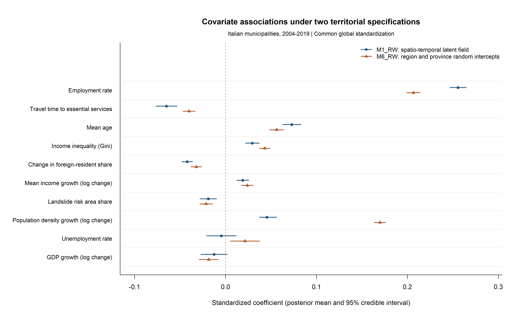

# M1_RW vs M6_RW: Coefficient Comparison

This figure compares estimated covariate associations with municipal net
migration rates in Italy over 2004–2019 under two alternative representations
of territorial heterogeneity:

- **M1_RW** combines a national RW1 temporal component with a municipal
  spatio-temporal latent field based on the adjacency structure.
- **M6_RW** replaces the municipal spatial field with region and province
  random intercepts, together with national temporal components.

Both models estimate a common set of covariate coefficients across all
municipalities.

## How to read the figure

Points represent posterior means and horizontal lines show equal-tailed
95% credible intervals. The dashed vertical line marks zero.

The response and covariates are based on the same global standardization in
both models. Each coefficient therefore represents the conditional association
between a one-standard-deviation difference in a covariate and the net
migration rate, expressed in standard-deviation units, holding the other model
components fixed.

## Main findings

Several of the main associations are qualitatively stable across the two
territorial specifications. In particular, higher employment is positively
associated with net migration, whereas greater travel time to essential
services is negatively associated with it. The estimated directions are also
consistent across specifications for several other covariates.

The magnitude of some associations is nevertheless sensitive to how
territorial heterogeneity is represented. The clearest example is population
density growth, whose estimated positive association is substantially larger
under M6_RW. Estimates for unemployment and GDP growth are also relatively
close to zero and more dependent on model specification.

Overall, the comparison suggests that a number of the main national
associations are robust to a substantial change in the representation of
territorial structure, while the estimated magnitude and uncertainty of some
coefficients are model-dependent.
