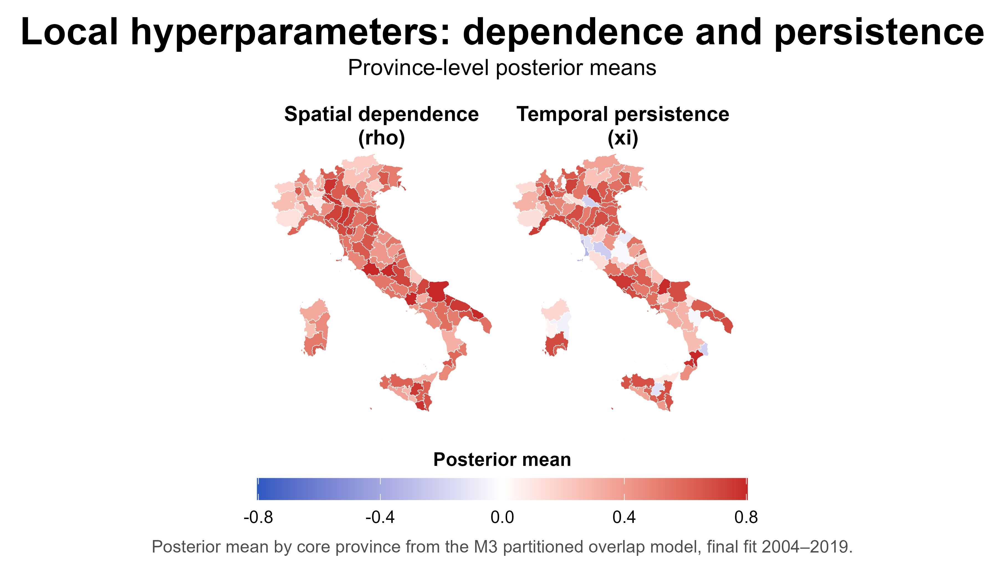
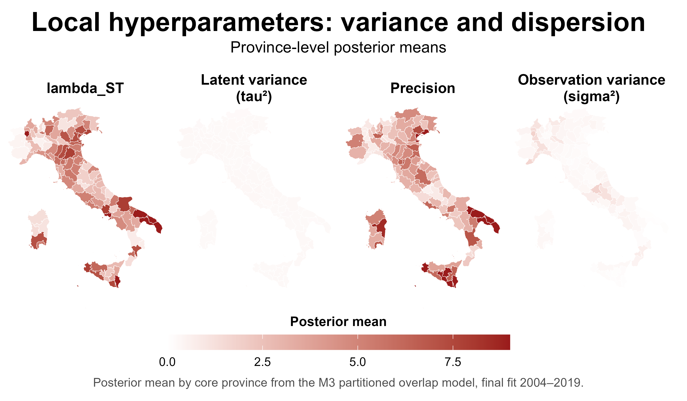
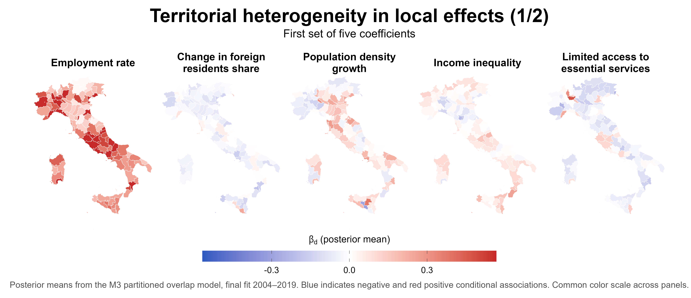
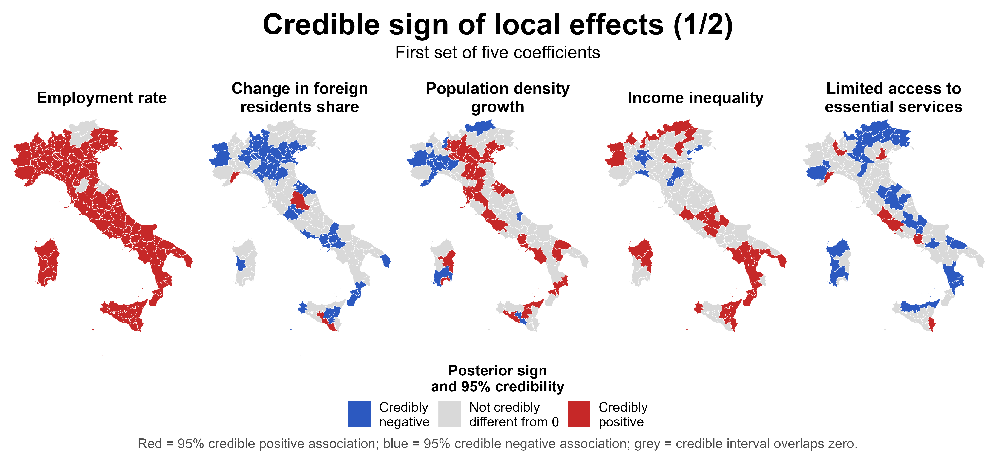
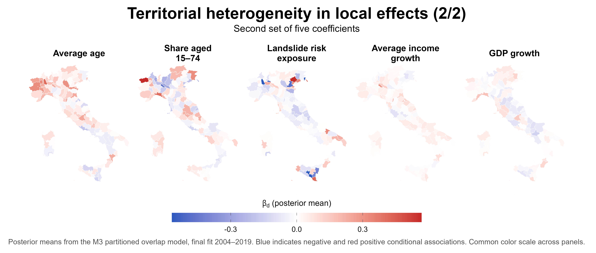
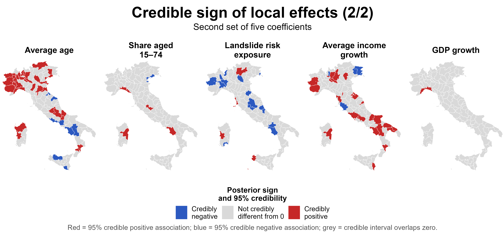

# M3 — Partitioned Overlap Model: Local Effects and Hyperparameters

This folder contains the main figures from the **M3 partitioned overlap model**, refitted on the full 2004–2019 period for the interpretative analysis.

M3 estimates a separate local model for each province while including neighbouring municipalities from adjacent provinces in the fitting domain. These additional municipalities are used only to reduce boundary effects; the reported estimates correspond to the **core province** of each local fit.

The figures therefore describe how covariate associations and spatio-temporal parameters vary across provinces under the overlap specification.

---

## 1. Local dependence and temporal persistence

### `M3_hyperparameters_dependence.png`

The figure reports province-level posterior means for the two main dependence parameters:

- **Spatial dependence (`rho`)** controls the strength of the local Leroux spatial structure. Larger values indicate stronger spatial smoothing and greater dependence between neighbouring municipalities.
- **Temporal persistence (`xi`)** controls how strongly the local latent spatial pattern persists from one year to the next.

The maps show that both quantities vary substantially across provinces, supporting the idea that a single national dependence structure may be restrictive.

Spatial dependence is generally positive and relatively strong, although its magnitude differs geographically. Temporal persistence is more heterogeneous: most provinces show positive persistence, but some areas display weak or locally negative posterior means.

Because the two parameters have different admissible ranges and interpretations, the common diverging colour scale is intended primarily to show their **geographical variation**, not to imply direct numerical comparability between `rho` and `xi`.

---

## 2. Local variance and dispersion parameters

### `M3_hyperparameters_variance.png`

This figure maps posterior means of the local variance- and precision-related quantities used by the M3 model:

- **`lambda_ST`**: precision-related parameter for the latent spatio-temporal component;
- **Latent variance (`tau²`)**: scale of residual spatio-temporal heterogeneity;
- **Precision**: corresponding precision representation;
- **Observation variance (`sigma²`)**: residual variance of the observation model.

These quantities also vary across provinces, indicating that the amount of unexplained latent and observational variability is not spatially homogeneous.

The panels use a common colour scale for compact visualization. Since these parameters are expressed on different numerical scales and some are alternative variance/precision representations, colours should be interpreted mainly **within each panel** rather than compared directly across parameters.

---

## 3. Territorial heterogeneity in local covariate associations — first set

### `M3_local_effects_first5_mean.png`

The figure maps province-specific posterior means of the local regression coefficients for:

- employment rate;
- change in foreign-resident share;
- population density growth;
- income inequality (Gini);
- limited access / travel time to essential services.

Blue indicates a negative conditional association with net migration and red a positive association. A common colour scale is used across panels.

The maps show clear territorial heterogeneity in both the magnitude and, for several covariates, the direction of the estimated associations.

The **employment rate** is the most geographically stable result in this group: its association with net migration is positive across almost the whole country, although the estimated magnitude varies between provinces.

By contrast, the associations for **change in foreign-resident share**, **population density growth**, **income inequality**, and **access to essential services** show more pronounced geographical variation.

Posterior means alone, however, do not indicate whether an association is credibly different from zero. For this reason they should be read together with the corresponding credibility map below.

---

## 4. Credible sign of local effects — first set

### `M3_local_effects_first5_sign.png`

This figure classifies each province according to the 95% credible interval of the corresponding local coefficient:

- **red**: credibly positive association;
- **blue**: credibly negative association;
- **grey**: the 95% credible interval overlaps zero.

This distinction is important because a positive or negative posterior mean does not necessarily imply strong posterior evidence for the sign of the association.

The employment effect is credibly positive in almost all provinces, confirming a highly stable positive association.

The remaining covariates are more heterogeneous. In particular:

- the change in foreign-resident share is credibly negative in many northern and central provinces, with some positive local exceptions;
- population density growth shows both credibly positive and credibly negative areas;
- the Gini coefficient displays geographically mixed signs;
- limited access to essential services is credibly negative in several areas, but positive in a smaller number of provinces.

These patterns illustrate why a single national coefficient can hide important local differences.

---

## 5. Territorial heterogeneity in local covariate associations — second set

### `M3_local_effects_second5_mean.png`

The second set contains posterior means for:

- average age;
- share aged 15–74;
- landslide-risk exposure;
- average income growth;
- GDP growth.

Compared with employment, these associations are generally weaker and more spatially heterogeneous.

Average age tends to show positive associations in several northern and central provinces, while negative values appear in parts of the South. The other covariates display more localized patterns and posterior means that are often close to zero.

As above, these maps should be interpreted together with the corresponding credible-sign maps.

---

## 6. Credible sign of local effects — second set

### `M3_local_effects_second5_sign.png`

The credible-sign maps reveal that the second group contains substantially more uncertainty and spatial fragmentation.

- **Average age** has credibly positive associations in several northern provinces and credibly negative associations in some southern areas.
- **Share aged 15–74** is not credibly different from zero in most provinces, with only a few localized exceptions.
- **Landslide-risk exposure** shows a limited number of credibly positive and negative local associations.
- **Average income growth** exhibits a mixture of positive and negative credible effects across selected provinces.
- **GDP growth** is not credibly different from zero in almost all provinces.

This reinforces the distinction between covariates whose association appears relatively stable across Italy and covariates whose relationship with net migration is strongly local or weakly identified.

---

## Main interpretation

Taken together, the M3 results provide evidence that the assumption of a completely homogeneous national model is too restrictive for some components of the migration process.

Two different forms of territorial heterogeneity emerge:

1. **The dependence structure varies geographically.**  
   Spatial dependence and temporal persistence are not constant across provinces.

2. **Some covariate associations vary geographically.**  
   Employment shows a particularly stable positive association, whereas several other covariates display changes in magnitude, credibility, and sometimes sign across provinces.

M3 should therefore not be interpreted as producing one alternative national coefficient for each covariate. Its main contribution is to show **where the national association is stable and where important local departures emerge**.

All associations are **conditional and descriptive rather than causal**. Differences between provinces may reflect observed covariates, latent territorial structure, and local model uncertainty, and should not be interpreted as isolated causal effects.

---

## Files

- `M3_hyperparameters_dependence.png` — local spatial dependence (`rho`) and temporal persistence (`xi`)
- `M3_hyperparameters_variance.png` — local variance and precision parameters
- `M3_local_effects_first5_mean.png` — posterior means for the first five local coefficients
- `M3_local_effects_first5_sign.png` — credible signs for the first five local coefficients
- `M3_local_effects_second5_mean.png` — posterior means for the second five local coefficients
- `M3_local_effects_second5_sign.png` — credible signs for the second five local coefficients
